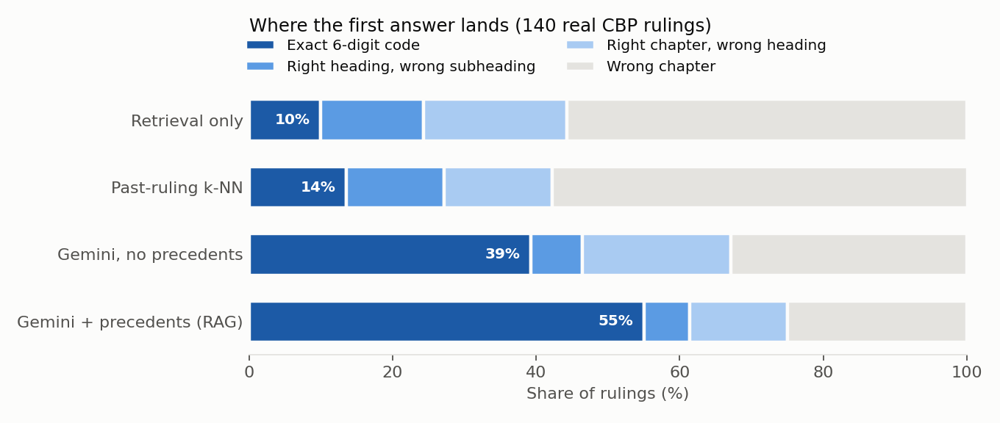
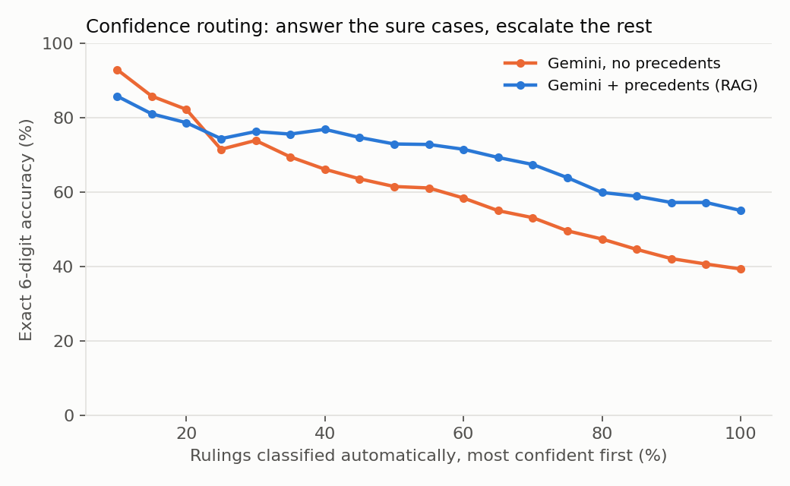

# TariffSense

**HS code classification with retrieval-augmented generation, scored against real US Customs rulings.**

Every product that crosses a border needs a Harmonized System (HS) code. It decides the duty paid, the
trade controls that apply and the statistics it is counted in. Brokers pick codes by reading the legal
nomenclature and by checking how Customs classified similar goods before. TariffSense does the same:

1. **Retrieve** candidate codes two ways:
   - from the HS 2022 nomenclature (5,613 subheadings), with hybrid BM25 + dense embeddings
   - from **3,239 past US Customs (CBP) rulings**, each a product and its official code, used as precedent
2. **Expand** to every sibling subheading under the retrieved headings, because the right heading with
   the wrong subheading is the most common miss.
3. **Generate:** Gemini reads the product, the precedents and the candidates. Using the General Rules of
   Interpretation, it returns one code, a confidence, a rationale and alternatives, as schema-checked JSON.

## Results

Scored on **140 held-out CBP rulings** (Aug 7 to Sep 4 2026, 36 HS chapters), with `gemini-3.5-flash-lite`.
"Top-1" means the first code is exactly right.

| Method | Top-1, 6-digit | Top-3, 6-digit | Top-1, heading (4) | Top-1, chapter (2) |
|---|---|---|---|---|
| Nomenclature retrieval only (BM25 + bge, RRF) | 10.0% | 17.9% | 24.3% | 44.3% |
| Past-ruling k-NN vote | 13.6% | 32.9% | 27.1% | 42.1% |
| Gemini, nomenclature candidates only | 39.3% | 55.7% | 46.4% | 67.1% |
| **Gemini + precedents (TariffSense)** | **55.0%** | **72.1%** | **61.4%** | **75.0%** |



**What the numbers say**

- **Precedents are the main win.** On the same 400 test queries, the right code is among the top-20
  nomenclature hits 44.0% of the time. Adding precedents and sibling subheadings puts it among the candidates
  79.8% of the time. With the LLM on top, precedents add **+15.7 points** of top-1 accuracy (39.3% to 55.0%).
- **It isn't tied to one model.** `gemini-3.1-flash-lite` on the same 140 rulings also scores 55.0% top-1
  (74.3% top-3).
- **What's left to fix:** about half of the remaining errors (49%) had the right code among the candidates, so
  better selection could close them. The rest are retrieval misses. Machinery (chapter 84: 35%) and electronics
  (chapter 85: 30%) are the hardest chapters.
- **Dev agrees:** on the 100 dev rulings the same system scores 53% top-1 and 75% top-3.

### Can it say when it is unsure?

| Gemini's stated confidence | Rulings | Actually correct |
|---|---|---|
| 0.80 to 0.90 | 42 | 26% |
| 0.90 to 0.95 | 8 | 38% |
| 0.95 to 1.00 | 89 | 71% |

The model's self-reported confidence ranks cases sensibly but is **overconfident**: a stated 0.85 is right
about a quarter of the time. Routing only the most confident half of the products to auto-accept gives
72.9% top-1 on that half.



**A routing rule that did not survive the test set.** On dev, auto-accepting only when confidence was at
least 0.95 *and* the pick was among the top 3 codes of the precedent vote gave 88.9% accuracy on 27% of
products. On test, the same rule (fixed in `config.py` and not re-tuned) gives **66.0% on 35.7%** of
products (80.0% at the heading level), against 48.9% for the rest. The gap is real but much smaller than
dev suggested. The rule was chosen on 27 examples and overfit them. The API still returns
`route: auto | review` with this rule, and the evaluation reports the honest test number.

### The agent

`src/agent.py` gives Gemini four tools: `search_nomenclature`, `search_precedents`, `list_subheadings` and
`submit_classification`, with a 5-turn budget. It starts from the same context as the RAG pipeline. It is
implemented, unit-tested and smoke-tested, but **not benchmarked yet**: the free-tier quota and a memory
limit stopped the run. `python -m src.evaluate --split test --limit 140 --methods agent` reproduces it.

### Why only 140 test rulings?

The free tier of `gemini-3.5-flash-lite` allows 500 requests a day. Dev (200 calls) plus 140 test rulings
(280 calls) used the day's quota, and the run stopped cleanly. `python -m src.evaluate --split test` will
continue to all 400 on a later day, reusing every cached answer.

## Evaluation: real rulings, no leakage

- **Test set:** the 500 most recent CBP classification rulings (June to September 2026), across 55 HS
  chapters, taken newest-first from a generic search rather than hand-picked. The first 100 are a dev set,
  used for every design choice. The rest are test, and only the first 140 have been scored so far
  (see above).
- **Query:** the ruling's product subject plus its facts section. Everything that could give the answer
  away, such as tariff numbers or any mention of "heading", "chapter", "HTSUS" or "classified", is cut out
  of the text.
- **Precedents:** only rulings dated before the earliest test ruling, so no test answer can be looked up.
- **Ground truth:** the first 6 digits of the official US code (HTSUS), which is the international HS code.

## Run it

```bash
pip install -r requirements.txt
python -m src.fetch_rulings        # eval set from the CBP CROSS API
python -m src.fetch_precedents     # precedent knowledge base (rulings before the eval period)
python -m src.eval_retrieval       # retrieval benchmark -> results/retrieval.csv
export GEMINI_API_KEY=...          # free key from https://aistudio.google.com/apikey
python -m src.evaluate --split dev
python -m src.evaluate --split test
streamlit run app.py               # demo
uvicorn src.api:app                # REST API: POST /classify, GET /search, GET /health
docker build -t tariffsense . && docker run -e GEMINI_API_KEY=... -p 8000:8000 tariffsense
pytest -q
```

LLM answers are cached on disk by prompt hash, so evaluations can be rerun and resumed without new
API calls. If the free tier's daily quota runs out, the evaluation stops cleanly and scores only the
rulings it finished.

## Layout

| Path | What it does |
|---|---|
| `src/hs.py` | HS 2022 nomenclature, one document per subheading: chapter > heading > subheading |
| `src/fetch_rulings.py` | Eval set from CBP rulings, with leak-proof query text |
| `src/fetch_precedents.py` | Precedent knowledge base, strictly older than the eval set |
| `src/retrieve.py` | BM25, bge embeddings, reciprocal rank fusion, precedent k-NN, candidate builder |
| `src/classify.py` | Prompt, Gemini call with JSON schema, retries, disk cache, validation |
| `src/agent.py` | Tool-calling agent: Gemini searches and checks before it submits a code |
| `src/evaluate.py` | End-to-end comparison of the methods at 2, 4 and 6 digits; stops cleanly on quota |
| `src/analysis.py` | Error levels, calibration, selective accuracy, routing, figures |
| `src/api.py`, `app.py` | FastAPI service and Streamlit demo |

## Limits

- The ground truth is US classification. The first 6 digits are international, but national practice can
  differ at the margins.
- The precedent base holds only rulings with a single code and a standard subject line, about 3.2k of them.
  A production system would index the full ruling texts.
- This is a research prototype, not customs advice.
